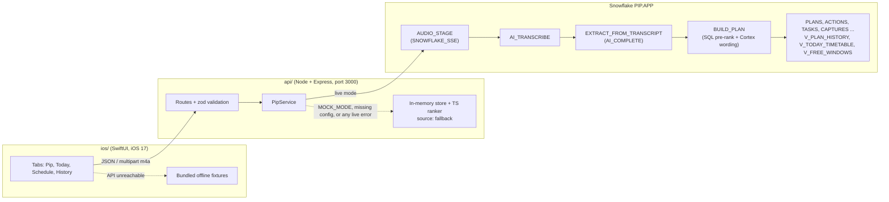

# Pip

Pip is a voice-first iOS companion for first-time independent university students. It appears as a small penguin. The student holds a button and describes an overloaded day, for example: a lab at 2, a refund deadline, an assignment due tomorrow, groceries on $35 until Friday. Pip answers out loud with one practical next action ("do now") and a Today Plan built around their timetable, their money and basic needs such as food and sleep.

Snowflake Cortex is the brain. `AI_TRANSCRIBE` turns speech into text, and the stored procedures `EXTRACT_FROM_TRANSCRIPT` and `BUILD_PLAN` turn the transcript into tasks and a ranked plan. A deterministic ranker (in SQL inside Snowflake, and in TypeScript inside the API) keeps the demo working when Cortex or the network is unavailable.

## Architecture



Repo layout:

- `docs/CONTRACT.md`: the source of truth covering endpoints, ranker rules, demo data and procedure interfaces. The exact JSON types are in `api/src/types.ts`.
- `api/`: the Express API.
  - `src/routes/`: HTTP routes.
  - `src/service.ts`: tries the live backend first and falls back to memory on any error.
  - `src/backends/`: `live.ts` (Snowflake) and `memory.ts` (the in-memory store).
  - `src/ranker/`: the deterministic ranker, decay curves, diff logic and heuristic extraction.
  - `src/demo/`: the demo scenario.
  - `test/`: the vitest suite.
  - `tools/fixtures.ts`: generates the iOS offline fixtures.
- `snowflake/`: SQL files numbered `01`–`06`.
  - `03_functions.sql` is generated from `src/` by `build.mjs`.
  - `NOTES.md` describes how the API calls the procedures.
- `ios/Pip/`: the iOS app.
  - `Pip.xcodeproj` is an Xcode 16 synchronized-folder project; `project.yml` is the XcodeGen equivalent.
  - `Pip/` holds the app source.
  - `Pip/Resources/Offline/` holds the fixtures.
  - `Support/Info.plist` holds the App Transport Security and local network keys.

## Setup

Run these steps in order on a fresh clone.

1. **Install the API.**
   ```sh
   cd api && npm install
   ```
2. **Configure it.** Run `cp .env.example .env` (in PowerShell: `Copy-Item .env.example .env`) and fill in the Snowflake values; see [Env](#env).
   For a zero-config demo, set `MOCK_MODE=true` and skip steps 3 and 4.
3. **Create the Snowflake objects.** In a Snowsight worksheet, run `snowflake/01_schema.sql`, `02_stage.sql`, `03_functions.sql`, `04_views.sql` and `05_seed.sql`, in that order. `06_smoke_test.sql` is optional; it changes the demo rows, so re-run `05` afterwards.
   - **Time zone first.** Before `05_seed.sql`, and in any worksheet that calls the procedures, run `ALTER SESSION SET TIMEZONE = 'America/Los_Angeles';` with your laptop's IANA zone. Every timestamp column holds local wall-clock time.
   - **Cortex access.** If your role lacks it, run this as ACCOUNTADMIN: `GRANT DATABASE ROLE SNOWFLAKE.CORTEX_USER TO ROLE <your_role>;`
   - **Claude in your region.** `claude-sonnet-4-5` is not hosted in every region. If the check in `03_functions.sql` picks `mistral-large2` or `llama3.1-8b` and you want Claude, run this as ACCOUNTADMIN, then re-run `03_functions.sql`: `ALTER ACCOUNT SET CORTEX_ENABLED_CROSS_REGION = 'ANY_REGION';`
4. **Seed the demo.** Run `npm run seed`. It re-anchors the six `demo-*` tasks to the scenario clock and stores the seeded Today Plan in Snowflake.
5. **Start the API.** Run `npm run dev`. On boot it prints `Pip API <mode> on http://<LAN IP>:3000`.
6. **Run the iOS app.** Open `ios/Pip/Pip.xcodeproj` in Xcode 16 or later.
   - **Xcode 15:** it cannot read this project format. Run `brew install xcodegen && cd ios/Pip && xcodegen generate` and open the regenerated project.
   - **API address:** set `defaultAPIBaseURL` in `ios/Pip/Pip/Config.swift` to `http://<laptop LAN IP>:3000`, using the address the API printed. The default `http://localhost:3000` only works in the Simulator. You can also change the address in the app under **Schedule → Server**.
   - **Signing:** pick a team under Signing & Capabilities. If the bundle ID `com.pivothacks.pip` is taken, change it.
   - **Run on the device.** The phone and the laptop must be on the same Wi-Fi network.
   - **Command-line build check (no signing):**
     ```sh
     xcodebuild -project ios/Pip/Pip.xcodeproj -scheme Pip -destination 'generic/platform=iOS Simulator' CODE_SIGNING_ALLOWED=NO build
     ```

Other commands:

| Command | What it does |
|---|---|
| `npm run build` | Compiles `src` into `dist/` and typechecks src, test, tools and scripts |
| `npm test` | Runs the vitest suite (ranker on all 7 weekdays, extraction, API, service, time zones) |
| `npm run fixtures` | Runs the API in mock mode and rewrites the 9 JSON files in `ios/Pip/Pip/Resources/Offline/` |
| `node snowflake/build.mjs` | Regenerates `snowflake/03_functions.sql` from `snowflake/src/*` and syntax-checks the JavaScript procedure bodies. Never hand-edit `03`. |
| `npm start` | Runs the compiled `dist/server.js` |

The `npm` commands run from `api/`; `node snowflake/build.mjs` runs from the repo root.

## Env

The API reads `api/.env`. That file is gitignored; never commit it.

| Variable | Default | Meaning |
|---|---|---|
| `SNOWFLAKE_ACCOUNT` | empty | Account identifier, e.g. `orgname-accountname`, without `.snowflakecomputing.com` |
| `SNOWFLAKE_USER` | empty | Login user |
| `SNOWFLAKE_PASSWORD` | empty | Password |
| `SNOWFLAKE_WAREHOUSE` | empty | Warehouse; `01_schema.sql` creates `PIP_WH` |
| `SNOWFLAKE_DATABASE` | `PIP` | Database created by `01_schema.sql` |
| `SNOWFLAKE_SCHEMA` | `APP` | Schema created by `01_schema.sql` |
| `SNOWFLAKE_ROLE` | empty (user's default role) | Role; it needs Cortex access |
| `MOCK_MODE` | `false` | `true` runs the whole demo with no Snowflake. If `false` but any of ACCOUNT, USER, PASSWORD or WAREHOUSE is missing, the API also runs in mock mode. |
| `PORT` | `3000` | HTTP port; the API listens on `0.0.0.0` |
| `LOG_LEVEL` | `info` | `debug`, `info`, `warn` or `error`. `debug` prints every SQL statement. |
| `DEMO_NOW` | `13:13` in mock mode, real time in live mode | `HH:MM` freezes the scenario clock at that time today; `real` uses the real local time |
| `PIP_TIMEZONE` | the laptop's IANA zone | Zone for plan math and the Snowflake session `TIMEZONE` |

See `api/.env.example` for the authoritative list.

## Demo script (60 s)

The sentence to say:

> I have a 2 PM lab. I need to return headphones by 5 PM or lose the refund. My assignment is due tomorrow. I need groceries, and I have $35 until Friday. What should I do?

1. **0:00. Open the app on the Pip tab.** Today's CHEM 110 Lab block (2:00–5:00 PM) and the free-window pill "47 min free until CHEM 110 Lab, 2:00 PM" are visible.
2. **0:05. Hold to talk and say the sentence.** Release when done.
3. **0:15. The transcript card appears** with what Snowflake heard.
4. **0:18. Pip speaks do now: return the headphones.** The $79 refund is gone for good at 5:00 PM, and you are in Lab from 2:00 to 5:00. The 35-minute return fits in the 47 free minutes before the 2 PM lab, with 12 minutes to spare.
5. **0:25. Open the Today tab** and walk the plan:
   - return headphones (now)
   - CHEM 110 Lab, 2:00–5:00 PM
   - CS 101 assignment, 5:15–6:45 PM, after Lab
   - groceries at 7:00 PM, under the $21 cap (60% of $35)
   - sleep at 11:30 PM, marked with a balance-guard flag because sleep was pushed back twice

   Point at the source label: **Snowflake** or **Local fallback**.
6. **0:35. Tap the chip "I only have 25 minutes."**
   - The banner explains what changed: "Only 25 min: the 35-min headphones return won't fit before Lab ($79 at risk), so do now is the assignment outline."
   - The return moves into Today with an at-risk flag, and do now becomes a 20-minute assignment outline with 5 minutes to spare before Lab.
   - Moved items animate, and Pip speaks the new do now.
7. **0:48. Tap Start now.**
8. **0:52. Open History → Decisions.** It shows the decision record: the capture plan, the 25-minute rerank plan with what changed, and the `start_now` action.
9. **0:58 (optional). Open History → Pivot Log.**

Before you present:

- ☐ `npm run dev` is running on the laptop, and the phone points at the printed LAN IP
- ☐ `GET /health` shows the expected `mode` (`live` or `mock`) and a filled `cortex` block (`complete`, `complete_model`, `transcribe`)
- ☐ Demo data is reset: `POST /demo/reset` for the in-memory store, or `npm run seed` (or re-run `05_seed.sql`) for Snowflake
- ☐ Phone volume up, silent switch off, and Pip not muted in the app
- ☐ The backup screen recording of the full demo is ready to play

## What's mocked

**`MOCK_MODE=true`**, or live mode without Snowflake config:

- **Store:** everything runs from an in-memory store seeded with the CONTRACT section 5 demo: profile, timetable, six open tasks, a seeded plan and pivots 1 and 2.
- **Clock:** pinned at 13:13 today unless `DEMO_NOW` is set.
- **Voice:** `/captures/voice` ignores the audio. It returns the demo transcript, or "I only have 25 minutes." when `followup_plan_id` is present.
- **Plans:** plans come from the TypeScript ranker with hand-written demo wording on top. Inputs that differ from the exact demo get template wording.
- **Source:** every response reports `source: "fallback"`.
- **Reset:** `POST /demo/reset` restores the baseline and keeps pivot-log entries.

**iOS offline fixtures** are the 9 JSON files in `ios/Pip/Pip/Resources/Offline/`, generated by `npm run fixtures`. The app uses them only when the API is unreachable:
- At launch it checks `/health` with a 4-second timeout.
- If a live call fails with a network error, the app retries it once offline and stays offline.
- In offline mode, captures, reranks and actions still show up in History.

**Deliberately not built:**
- calendar OAuth or sync (the timetable is edited on the Schedule tab)
- maps and travel times
- live prices or bank data
- push notifications and reminders
- authentication and accounts (a single student, `demo`)
- multiple users
- Android
- a hosted API (it runs on the presenter's laptop)
- embedding-based task matching (tasks are merged with `JAROWINKLER_SIMILARITY` or the LLM's `existing_task_id`)

## Which Cortex functions verified

**None of them were verified from the build machine.** No Snowflake credentials were available while building, so none of the SQL has run on Snowflake. The procedure logic was exercised in Node against a fake Snowflake that answers with the demo data, and it reproduces CONTRACT section 5 for both the 13:13 plan and the 25-minute rerank. The iOS app was also not compiled on the build machine, which had no Xcode.

| Function | Used for | Verified from build machine | Verified at venue? |
|---|---|---|---|
| `AI_TRANSCRIBE` | Voice capture: staged m4a to transcript | No | ☐ fill in from GET /health or SELECT * FROM PIP.APP.CORTEX_CONFIG |
| `AI_COMPLETE` (`claude-sonnet-4-5` → `mistral-large2` → `llama3.1-8b`) | Task extraction and plan wording in `EXTRACT_FROM_TRANSCRIPT` / `BUILD_PLAN` | No | ☐ fill in from GET /health or SELECT * FROM PIP.APP.CORTEX_CONFIG |
| `SNOWFLAKE.CORTEX.COMPLETE` (same model chain) | Used if `AI_COMPLETE` is unavailable | No | ☐ fill in from GET /health or SELECT * FROM PIP.APP.CORTEX_CONFIG |
| `AI_EMBED` (`snowflake-arctic-embed-m-v1.5`) | Probed and recorded only | No | ☐ fill in from GET /health or SELECT * FROM PIP.APP.CORTEX_CONFIG |
| `SNOWFLAKE.CORTEX.EMBED_TEXT_768` | Probed if `AI_EMBED` is unavailable | No | ☐ fill in from GET /health or SELECT * FROM PIP.APP.CORTEX_CONFIG |

There are two ways to verify.

**The check in `03_functions.sql`** is block (a), which runs when you run the file.
- **Completion:** it tries each function and model with the prompt "Reply with the single word OK.". The first success wins.
- **Embeddings:** it tries `AI_EMBED`, then `EMBED_TEXT_768`.
- **Transcription:** it calls `AI_TRANSCRIBE` on a file that does not exist. An "unknown function" error means the function is unavailable; any other error means it exists. This result is a guess from error text only.
- **Recording:** it MERGEs the result into `PIP.APP.CORTEX_CONFIG` (keys `complete_fn`, `complete_model`, `embed_fn`, `transcribe_fn`, each with `verified_at`) and returns the collected errors.

**The API's `GET /health`** reports `cortex {transcribe, complete, complete_model, embed, verified_at, errors}`.
- Verification runs in the background at API boot, and again on `GET /health?refresh=1`. It tries the completion and embedding chains, PUTs a generated 1-second silent WAV to `@AUDIO_STAGE/_probe/` and calls `AI_TRANSCRIBE` on it, then MERGEs the results into `CORTEX_CONFIG`. This is the definitive check. A real iOS m4a is only tested by an actual voice capture.
- The procedures read `CORTEX_CONFIG` and try the recorded function and model first, then the full chain. Each attempt is isolated, so a missing function only fails that attempt.
- If every completion attempt fails, `BUILD_PLAN` still returns the deterministic plan, with model `sql-prerank`.

Audio handling:
- The iOS app records mono AAC `.m4a`, and the API uploads it with `AUTO_COMPRESS = FALSE`.
- If `AI_TRANSCRIBE` rejects the `.m4a`, the API retries the same bytes staged as `.mp4`.
- If that also fails, the response carries `needs_text: true` and the app asks the student to type.

## Assumptions

- **Scenario clock.** Mock mode pins 13:13 today, which gives "47 min free until CHEM 110 Lab, 2:00 PM". The pin applies whenever the effective mode is mock, including `MOCK_MODE=false` without Snowflake config. Record timestamps (`created_at`) always use the real wall clock.
- **Today's lab exists every day.** The demo CHEM 110 Lab (14:00–17:00, Science Hall 204) is added on today's weekday, weekends included, so the demo works on any day.
- **Days use ISO numbering:** 1 = Monday through 7 = Sunday (`DAYOFWEEKISO`).
- **Time zones.**
  - Snowflake timestamps are `TIMESTAMP_NTZ` holding local wall time.
  - The API sets the session `TIMEZONE` to `PIP_TIMEZONE`, reads timestamps with `TO_VARCHAR` and appends the local offset itself. It never uses snowflake-sdk Date objects, which read NTZ as UTC.
  - API datetimes look like `2026-09-14T17:00:00-07:00`.
- **"Friday"** in speech means the next Friday strictly after today; on a Friday it means a week later.
- **Endpoints beyond the brief:** `GET /timetable` (full week), `GET /profile` and `POST /demo/reset`, added for the Schedule screen and demo resets.
- **Source labels.** `source` has two values, `snowflake` or `fallback`, and mock mode always reports `fallback`. The API never returns 500: invalid input gets 400 `{source, error}`, and any live error falls back to the in-memory backend.
- **Follow-ups.**
  - A voice follow-up is sent to `/captures/voice` with `followup_plan_id`. The transcript becomes `context.question`, no new tasks are extracted, and the response carries `diff` and `previous_plan_id`.
  - The iOS chips call `POST /plans/rerank` with `context.question`.
  - Minutes and cash are parsed from the text: "25 minutes", "half an hour", "$20".
- **The 25-minute rerank does not suggest being late.** The 35-minute return no longer fits before Lab, so it is flagged `at_risk`, with a warning that $79 is at risk unless 10 more minutes turn up. Do now becomes the 20-minute assignment outline.
- **Ranker constants.**
  - First step: 20 minutes for assignment, work or class tasks (`min(est, 20)`); otherwise the estimate, or 15 minutes if unknown.
  - Scheduling: slots start 15 minutes after the next block ends, with 15-minute gaps and sessions of at most 90 minutes.
  - Bedtime by chronotype: early bird 22:30, neutral 23:00, night owl 23:30.
  - Money: grocery cap = `floor(cash × 0.6)`, daily budget = cash ÷ days until `budget_until`.
- **Balance guard.** A meal or rest task open for 36 hours or more, or deferred at least twice, is flagged `balance_guard` and always kept in Today. Rest items go at bedtime and meal items get an evening slot. Guard items are never do now.
- **Rules and scores.** There are five rules: irreversible loss, fixed-block collision, basic needs, fits the window, near academic deadline. They are weighted 10000/1000/100/10/1, with a decay-curve tiebreak. Every task item carries 5 evidence rows and a cost-of-delay curve.
- **The LLM rewrites wording only.** Do now, section membership and order always come from the deterministic SQL pre-rank. Cortex may change `title`, `action`, `why` (cut to one sentence), `summary` and `answer`.
  - It may also propose slot times, which are kept only if valid: same day, not in the past, not over a fixed block, at most 180 minutes, and not flagged or rest.
  - Unknown task ids from the LLM are dropped.
- **Procedures are JavaScript, not Snowflake Scripting.** `EXTRACT_FROM_TRANSCRIPT`, `BUILD_PLAN` and `RECORD_ACTION` are `LANGUAGE JAVASCRIPT EXECUTE AS CALLER`.
  - Building nested plan JSON in Scripting is fragile; in JavaScript every statement uses bind variables and each Cortex attempt has its own try/catch.
  - The pre-rank is still one SQL query using helper UDFs.
  - Only the Cortex check in `03` is a Scripting block.
  - Nulls are never bound: empty strings become NULL via `NULLIF(?, '')`.
  - The model name is inserted as a validated literal and the prompt as a bind.
  - Procedures return `{error}` instead of throwing.
- **`CORTEX_CONFIG`** is an extra table that records which Cortex function and model work in this account. The check in `03` and `/health` write it; the procedures read it.
- **Contract gaps filled.**
  - A spoken fixed block with no end time lasts 60 minutes.
  - Timetable and spoken blocks with the same start minute are merged into one.
  - Explicit rerank minutes or cash override a spoken time window or cash constraint, which override the profile.
  - With no next block today, `next` is the second-best task that fits.
  - With no next block and under an hour free, the label reads "{m} min free today".
- **Lenient API inputs.**
  - GET routes default `student_id` to `demo`.
  - An action with an unknown `plan_id` attaches to the latest plan.
  - A `#cont` suffix on `task_id` is stripped.
  - An unknown student gets a copy of the demo baseline.
- **iOS app.**
  - It uses the bundled fixtures when the API is unreachable.
  - Presses under 0.35 seconds are discarded.
  - Captures and reranks time out after 60 seconds; other requests after 10 seconds.
- **Xcode project.**
  - It uses the Xcode 16 synchronized-folder format (objectVersion 77); on Xcode 15, regenerate it with xcodegen.
  - The iOS 17 deployment target is required for Observation and Charts.
  - Info.plist allows plain http, needed for LAN addresses.
- **No authentication.** A single demo student, `demo`, and the iOS app always sends it.

## Fallback chain

1. **Live audio.** `AI_TRANSCRIBE` on the staged m4a.
   Steps down when the upload or transcription fails after the `.mp4` retry, or the transcript is empty (`needs_text: true`).
2. **Typed input.** The student types into the transcript card, or taps "Use demo sentence".
   Steps down when there is no working microphone or voice upload, or the presenter prefers not to speak.
3. **Live plan.** `EXTRACT_FROM_TRANSCRIPT` and `BUILD_PLAN` with Cortex wording; source `snowflake`.
   Steps down when every Cortex completion attempt fails or its output cannot be parsed twice.
4. **Deterministic plan.** First, the SQL pre-rank inside Snowflake (model `sql-prerank`, source `snowflake`).
   If the Snowflake call itself errors, or the connection or config is missing, the API runs the TypeScript ranker in memory (source `fallback`).
5. **Mock plan.** `MOCK_MODE=true` serves the in-memory demo. If the phone cannot reach the API at all, the app serves its bundled offline fixtures.
   Choose this before presenting if venue Wi-Fi or Snowflake is unreliable.
6. **Backup screen recording** of the full 60-second demo.
   Use it when the phone, laptop or projector setup fails.

## Pivot Log

Seeded by `snowflake/05_seed.sql` and by the mock store:

| # | Revealed | Assumption changed | Response | Cut | Sentence |
|---|---|---|---|---|---|
| 1 | Problem 7 — Prioritization | Generic user | Voice-first ranker with decay curves, with Snowflake as the brain | None | Problem 7 is prioritization, so Pip turns a spoken, overloaded day into one ranked next action with Snowflake Cortex as the brain. |
| 2 | User is a first-time independent university student | Generic urgency → practical cost of delay against classes, money, and basic needs | Timetable, budget window, free-window math, basic-needs guard; Today Plan replaces the score | Generic corpus comparison | We learned our user is a first-time independent student, so Pip now plans around classes, money, and practical life errands — not generic task urgency. |

Pivot 3:

| Field | Value |
|---|---|
| revealed | Context must be explicit, live and causal, not just displayed |
| assumption_changed | Free time was a ranking weight → free time before the next fixed class is a hard filter on do now |
| response | `available_minutes = (next protected start − arrival buffer) − simulated now`, recomputed per request; full-path checks around protected commitments; cumulative spending in cents with a protected reserve; result state + provenance; `POST /context/plan`, `/context/preview`, `/context/actions`, `GET /context/history`; Today context strip with a Full / 48 / 25 min control |
| cut | Prep-step durations the student didn't supply, success probabilities, scenario persistence |
| sentence | We made available time before the next class a hard planning constraint, so Pip changes what it recommends instead of just showing the schedule. |

Pivot 3 demo (fixture `api/src/demo/pivot3.ts`, simulated Monday 12:40 PM, America/Toronto): on Today, switch **Update context** from 48 min to 25 min. At 48 min the do now is the 40-minute return outing (back by 1:20 PM; after Lab it would finish at 5:15 PM, past the 5:00 PM cutoff). At 25 min the outing is rejected for that window and do now becomes the 20-minute assignment start. These plans are computed by the API's TypeScript planner and labelled `local_fallback`, including in live mode. The context planner does not run in Snowflake yet.

Pivot 4 (template):

| Field | Value |
|---|---|
| revealed | |
| assumption_changed | |
| response | |
| cut | |
| sentence | |

To add a pivot through the API (it appears under History → Pivot Log):

```sh
curl -X POST http://localhost:3000/pivot-log \
  -H 'Content-Type: application/json' \
  -d '{"pivot_number":3,"revealed":"<what judges or users revealed>","assumption_changed":"<assumption that changed>","response":"<what we built>","cut":"<what we cut>","sentence":"<one sentence for the pitch>"}'
```

Or directly in Snowflake:

```sql
INSERT INTO PIP.APP.PIVOT_LOG (entry_id, pivot_number, revealed, assumption_changed, response, cut, sentence, created_at)
SELECT 'pivot-3', 3, '<revealed>', '<assumption_changed>', '<response>', '<cut>', '<sentence>', CURRENT_TIMESTAMP()::TIMESTAMP_NTZ;
```

## API reference

Every response includes `source`. Types are in `api/src/types.ts`; semantics are in `docs/CONTRACT.md`.

| Method and path | Body / query | Returns |
|---|---|---|
| GET `/health` | `?refresh=1` re-verifies Cortex | mode, scenario `now`, Snowflake status, Cortex status |
| POST `/captures/voice` | multipart: `audio` (m4a), `student_id`, optional `followup_plan_id` | capture, transcript, `needs_text`, open tasks, plan (+ `diff` on follow-up) |
| POST `/captures/text` | `{student_id, text, followup_plan_id?}` | same as voice |
| POST `/plans/rerank` | `{student_id, plan_id, context:{available_minutes?, cash_available?, question?}}` | plan, `previous_plan_id`, `diff` |
| GET `/timetable/today` | `?student_id=` | today's blocks |
| GET `/timetable` | `?student_id=` | full week |
| PUT `/timetable` | `{student_id, blocks:[{day_of_week, title, starts_at, ends_at, location}]}` | full week (replaces it) |
| GET `/profile` | `?student_id=` | profile |
| PUT `/profile` | `{student_id, chronotype?, cooks_own_meals?, cash_available?, budget_until?, procrastinates_on?}` | profile (partial merge) |
| POST `/actions` | `{student_id, plan_id, task_id, kind: start_now or done or defer or drop}` | action, updated task |
| GET `/history` | `?student_id=` | plans and actions, newest first |
| GET `/pivot-log` | | entries ordered by `pivot_number` |
| POST `/pivot-log` | `{pivot_number, revealed, assumption_changed, response, cut, sentence?}` | entry |
| POST `/demo/reset` | `{student_id}` | `{ok: true}` |

```sh
# 1. Health: mode, clock and Cortex status
curl http://localhost:3000/health

# 2. Text capture with the demo sentence
curl -X POST http://localhost:3000/captures/text \
  -H 'Content-Type: application/json' \
  -d '{"student_id":"demo","text":"I have a 2 PM lab. I need to return headphones by 5 PM or lose the refund. My assignment is due tomorrow. I need groceries, and I have $35 until Friday. What should I do?"}'

# 3. Rerank with 25 minutes (use plan.plan_id from the capture response)
curl -X POST http://localhost:3000/plans/rerank \
  -H 'Content-Type: application/json' \
  -d '{"student_id":"demo","plan_id":"<plan_id>","context":{"question":"I only have 25 minutes"}}'
```

## Troubleshooting

- **The phone can't reach the API.**
  - Use the LAN IP the API printed on boot, not `localhost`.
  - Put the phone and laptop on the same Wi-Fi. Guest networks often block device-to-device traffic, so use a phone hotspot if needed.
  - Allow Node through the laptop firewall on port 3000 (Windows: private network; macOS: Firewall options).
  - Allow Pip under iOS Settings → Privacy & Security → Local Network.
  - To test, open `http://<IP>:3000/health` in the phone's Safari.
  - Change the address in the app under **Schedule → Server**.
- **`AI_TRANSCRIBE` rejects the m4a.**
  - The stage must use `SNOWFLAKE_SSE` encryption. An existing stage's encryption can't be changed, so `DROP STAGE PIP.APP.AUDIO_STAGE` and re-run `02_stage.sql`.
  - Files must be uploaded with `AUTO_COMPRESS = FALSE`.
  - The API retries the same bytes as `.mp4`. If that also fails, type the request or tap "Use demo sentence".
- **The model is not available in your region.** Run `ALTER ACCOUNT SET CORTEX_ENABLED_CROSS_REGION = 'ANY_REGION';` as ACCOUNTADMIN. Then re-run `03_functions.sql` or call `GET /health?refresh=1`, and check `SELECT * FROM PIP.APP.CORTEX_CONFIG`. Without Claude, the chain uses `mistral-large2`, then `llama3.1-8b`.
- **Times are wrong or shifted by hours.**
  - Set `PIP_TIMEZONE` in `api/.env`.
  - Run `ALTER SESSION SET TIMEZONE = '<zone>'` before `05_seed.sql`.
  - Set `DEMO_NOW=13:13` for the scripted numbers. Seconds count: 13:13:30 gives 46 free minutes, not 47.
- **Resetting demo data.**
  - Mock mode: `curl -X POST http://localhost:3000/demo/reset -H 'Content-Type: application/json' -d '{"student_id":"demo"}'`.
  - Snowflake: run `npm run seed`, or re-run `05_seed.sql`, which is always required after `06_smoke_test.sql`.
- **A SQL file fails on first run.**
  - The SQL has never been executed, so small syntax fixes may be needed. If `DEFAULT CURRENT_TIMESTAMP()::TIMESTAMP_NTZ` is rejected in `01`, drop the `::TIMESTAMP_NTZ` cast.
  - If `CALL ... PARSE_JSON(?)` is rejected, bind the JSON string with a plain `?`; `BUILD_PLAN` accepts both.
  - Fix procedures in `snowflake/src/` and run `node snowflake/build.mjs`, rather than editing `03`.
- **Responses say `fallback` in live mode.** The API logs `live <op> failed, using local fallback: <reason>`. Set `LOG_LEVEL=debug` to see every SQL statement.
